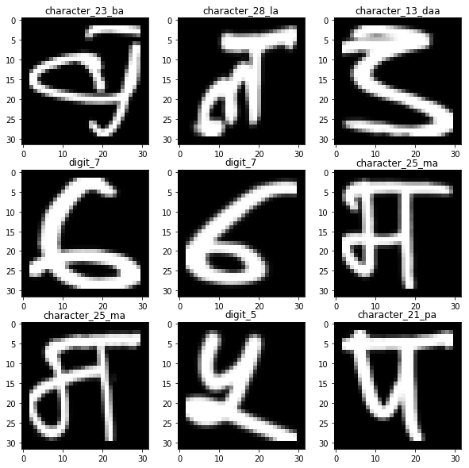
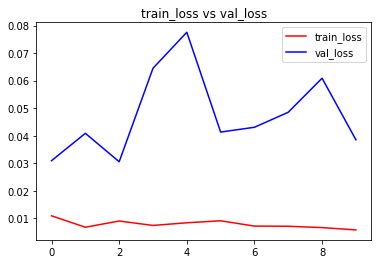
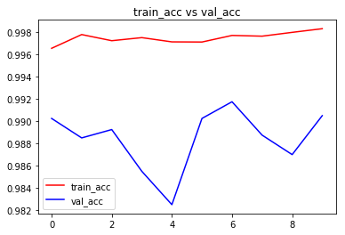
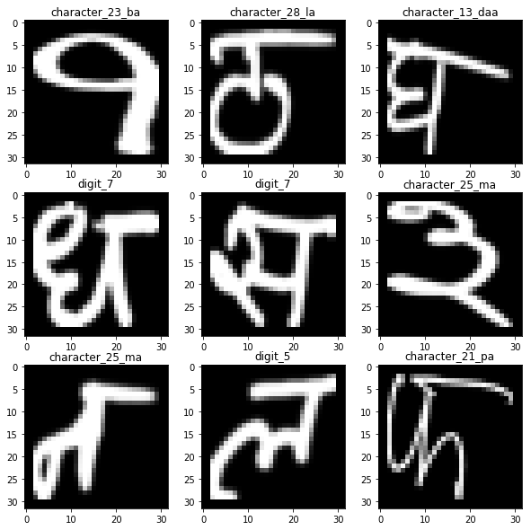

# Devnagari-Character-Recognization-using-CNN
[Dataset Download From this link](https://www.kaggle.com/rishianand/devanagari-character-set)
```python
# This Python 3 environment comes with many helpful analytics libraries installed
# It is defined by the kaggle/python docker image: https://github.com/kaggle/docker-python
# For example, here's several helpful packages to load in 

import numpy as np # linear algebra
import pandas as pd # data processing, CSV file I/O (e.g. pd.read_csv)
import matplotlib.pyplot as plt
%matplotlib inline

# Input data files are available in the "../input/" directory.
# For example, running this (by clicking run or pressing Shift+Enter) will list the files in the input directory

import os
print(os.listdir("../input"))

# Any results you write to the current directory are saved as output.
```

    ['Images', 'data.csv']
    


```python
df =  pd.read_csv("../input/data.csv")
df.head()
```


<div>
<style scoped>
    .dataframe tbody tr th:only-of-type {
        vertical-align: middle;
    }

    .dataframe tbody tr th {
        vertical-align: top;
    }

    .dataframe thead th {
        text-align: right;
    }
</style>
<table border="1" class="dataframe">
  <thead>
    <tr style="text-align: right;">
      <th></th>
      <th>pixel_0000</th>
      <th>pixel_0001</th>
      <th>pixel_0002</th>
      <th>pixel_0003</th>
      <th>pixel_0004</th>
      <th>pixel_0005</th>
      <th>pixel_0006</th>
      <th>pixel_0007</th>
      <th>pixel_0008</th>
      <th>pixel_0009</th>
      <th>...</th>
      <th>pixel_1015</th>
      <th>pixel_1016</th>
      <th>pixel_1017</th>
      <th>pixel_1018</th>
      <th>pixel_1019</th>
      <th>pixel_1020</th>
      <th>pixel_1021</th>
      <th>pixel_1022</th>
      <th>pixel_1023</th>
      <th>character</th>
    </tr>
  </thead>
  <tbody>
    <tr>
      <th>0</th>
      <td>0</td>
      <td>0</td>
      <td>0</td>
      <td>0</td>
      <td>0</td>
      <td>0</td>
      <td>0</td>
      <td>0</td>
      <td>0</td>
      <td>0</td>
      <td>...</td>
      <td>0</td>
      <td>0</td>
      <td>0</td>
      <td>0</td>
      <td>0</td>
      <td>0</td>
      <td>0</td>
      <td>0</td>
      <td>0</td>
      <td>character_01_ka</td>
    </tr>
    <tr>
      <th>1</th>
      <td>0</td>
      <td>0</td>
      <td>0</td>
      <td>0</td>
      <td>0</td>
      <td>0</td>
      <td>0</td>
      <td>0</td>
      <td>0</td>
      <td>0</td>
      <td>...</td>
      <td>0</td>
      <td>0</td>
      <td>0</td>
      <td>0</td>
      <td>0</td>
      <td>0</td>
      <td>0</td>
      <td>0</td>
      <td>0</td>
      <td>character_01_ka</td>
    </tr>
    <tr>
      <th>2</th>
      <td>0</td>
      <td>0</td>
      <td>0</td>
      <td>0</td>
      <td>0</td>
      <td>0</td>
      <td>0</td>
      <td>0</td>
      <td>0</td>
      <td>0</td>
      <td>...</td>
      <td>0</td>
      <td>0</td>
      <td>0</td>
      <td>0</td>
      <td>0</td>
      <td>0</td>
      <td>0</td>
      <td>0</td>
      <td>0</td>
      <td>character_01_ka</td>
    </tr>
    <tr>
      <th>3</th>
      <td>0</td>
      <td>0</td>
      <td>0</td>
      <td>0</td>
      <td>0</td>
      <td>0</td>
      <td>0</td>
      <td>0</td>
      <td>0</td>
      <td>0</td>
      <td>...</td>
      <td>0</td>
      <td>0</td>
      <td>0</td>
      <td>0</td>
      <td>0</td>
      <td>0</td>
      <td>0</td>
      <td>0</td>
      <td>0</td>
      <td>character_01_ka</td>
    </tr>
    <tr>
      <th>4</th>
      <td>0</td>
      <td>0</td>
      <td>0</td>
      <td>0</td>
      <td>0</td>
      <td>0</td>
      <td>0</td>
      <td>0</td>
      <td>0</td>
      <td>0</td>
      <td>...</td>
      <td>0</td>
      <td>0</td>
      <td>0</td>
      <td>0</td>
      <td>0</td>
      <td>0</td>
      <td>0</td>
      <td>0</td>
      <td>0</td>
      <td>character_01_ka</td>
    </tr>
  </tbody>
</table>
<p>5 rows × 1025 columns</p>
</div>


```python
df = df.sample(frac=1).reset_index(drop = True)
df.head()
```


<div>
<style scoped>
    .dataframe tbody tr th:only-of-type {
        vertical-align: middle;
    }

    .dataframe tbody tr th {
        vertical-align: top;
    }

    .dataframe thead th {
        text-align: right;
    }
</style>
<table border="1" class="dataframe">
  <thead>
    <tr style="text-align: right;">
      <th></th>
      <th>pixel_0000</th>
      <th>pixel_0001</th>
      <th>pixel_0002</th>
      <th>pixel_0003</th>
      <th>pixel_0004</th>
      <th>pixel_0005</th>
      <th>pixel_0006</th>
      <th>pixel_0007</th>
      <th>pixel_0008</th>
      <th>pixel_0009</th>
      <th>...</th>
      <th>pixel_1015</th>
      <th>pixel_1016</th>
      <th>pixel_1017</th>
      <th>pixel_1018</th>
      <th>pixel_1019</th>
      <th>pixel_1020</th>
      <th>pixel_1021</th>
      <th>pixel_1022</th>
      <th>pixel_1023</th>
      <th>character</th>
    </tr>
  </thead>
  <tbody>
    <tr>
      <th>0</th>
      <td>0</td>
      <td>0</td>
      <td>0</td>
      <td>0</td>
      <td>0</td>
      <td>0</td>
      <td>0</td>
      <td>0</td>
      <td>0</td>
      <td>0</td>
      <td>...</td>
      <td>0</td>
      <td>0</td>
      <td>0</td>
      <td>0</td>
      <td>0</td>
      <td>0</td>
      <td>0</td>
      <td>0</td>
      <td>0</td>
      <td>character_23_ba</td>
    </tr>
    <tr>
      <th>1</th>
      <td>0</td>
      <td>0</td>
      <td>0</td>
      <td>0</td>
      <td>0</td>
      <td>0</td>
      <td>0</td>
      <td>0</td>
      <td>0</td>
      <td>0</td>
      <td>...</td>
      <td>0</td>
      <td>0</td>
      <td>0</td>
      <td>0</td>
      <td>0</td>
      <td>0</td>
      <td>0</td>
      <td>0</td>
      <td>0</td>
      <td>character_28_la</td>
    </tr>
    <tr>
      <th>2</th>
      <td>0</td>
      <td>0</td>
      <td>0</td>
      <td>0</td>
      <td>0</td>
      <td>0</td>
      <td>0</td>
      <td>0</td>
      <td>0</td>
      <td>0</td>
      <td>...</td>
      <td>0</td>
      <td>0</td>
      <td>0</td>
      <td>0</td>
      <td>0</td>
      <td>0</td>
      <td>0</td>
      <td>0</td>
      <td>0</td>
      <td>character_13_daa</td>
    </tr>
    <tr>
      <th>3</th>
      <td>0</td>
      <td>0</td>
      <td>0</td>
      <td>0</td>
      <td>0</td>
      <td>0</td>
      <td>0</td>
      <td>0</td>
      <td>0</td>
      <td>0</td>
      <td>...</td>
      <td>0</td>
      <td>0</td>
      <td>0</td>
      <td>0</td>
      <td>0</td>
      <td>0</td>
      <td>0</td>
      <td>0</td>
      <td>0</td>
      <td>digit_7</td>
    </tr>
    <tr>
      <th>4</th>
      <td>0</td>
      <td>0</td>
      <td>0</td>
      <td>0</td>
      <td>0</td>
      <td>0</td>
      <td>0</td>
      <td>0</td>
      <td>0</td>
      <td>0</td>
      <td>...</td>
      <td>0</td>
      <td>0</td>
      <td>0</td>
      <td>0</td>
      <td>0</td>
      <td>0</td>
      <td>0</td>
      <td>0</td>
      <td>0</td>
      <td>digit_7</td>
    </tr>
  </tbody>
</table>
<p>5 rows × 1025 columns</p>
</div>


```python
df.shape
```


    (92000, 1025)


```python
train_df = df[0:80000].copy()
test_df = df[80000:].copy()
train_df.shape,test_df.shape
```


    ((80000, 1025), (12000, 1025))


```python
label = train_df['character'].values
y_train = np.zeros([train_df.shape[0],df['character'].unique().shape[0]])
```


```python
from sklearn.preprocessing import LabelBinarizer
binencoder = LabelBinarizer()
y_train = binencoder.fit_transform(label)
```


```python
train_df = train_df.drop(['character'],axis=1)
X_train = train_df.as_matrix()
X_train = np.reshape(X_train,(X_train.shape[0],32,32,1))
```


```python
X_train.shape
```


    (80000, 32, 32, 1)


```python
plt.figure(figsize=(10, 10))

for i in range(0, 9):
    plt.subplot(330 + 1 + i)
    plt.title(str(label[i]))
    plt.imshow(X_train[i].reshape((32,32)),cmap='gray')
# show the plot
plt.show()
```





```python
from keras import layers
from keras.layers import Input, Dense, Activation, ZeroPadding2D, BatchNormalization, Flatten, Conv2D
from keras.layers import AveragePooling2D, MaxPooling2D, Dropout, GlobalMaxPooling2D, GlobalAveragePooling2D
from keras.models import Model
from keras.preprocessing import image
from keras.utils import layer_utils
from keras.utils.data_utils import get_file
from keras.applications.imagenet_utils import preprocess_input

from IPython.display import SVG
from keras.utils.vis_utils import model_to_dot
from keras.utils import plot_model
```

    /opt/conda/lib/python3.6/site-packages/h5py/__init__.py:36: FutureWarning: Conversion of the second argument of issubdtype from `float` to `np.floating` is deprecated. In future, it will be treated as `np.float64 == np.dtype(float).type`.
      from ._conv import register_converters as _register_converters
    Using TensorFlow backend.
    


```python
def alpha_model(input_shape):
    X_in = Input(input_shape)
    
    X = Conv2D(16,kernel_size=(5,5),padding='same',input_shape=input_shape)(X_in)
    X = BatchNormalization()(X)
    X = Activation('relu')(X)
    X = MaxPooling2D((2,2))(X)
    
    X = Conv2D(16,kernel_size=(5,5),padding='same',input_shape=input_shape)(X)
    X = BatchNormalization()(X)
    X = Activation('relu')(X)
    X = MaxPooling2D((2,2))(X)
    
    X = Flatten()(X)
    X = Dense(128,activation='relu')(X)
    X = Dense(46,activation='softmax')(X)
    
    model = Model(inputs=X_in,outputs=X,name='devanagari')
    return model
```


```python
model = alpha_model((32,32,1))
model.summary()
```

    _________________________________________________________________
    Layer (type)                 Output Shape              Param #   
    =================================================================
    input_1 (InputLayer)         (None, 32, 32, 1)         0         
    _________________________________________________________________
    conv2d_1 (Conv2D)            (None, 32, 32, 16)        416       
    _________________________________________________________________
    batch_normalization_1 (Batch (None, 32, 32, 16)        64        
    _________________________________________________________________
    activation_1 (Activation)    (None, 32, 32, 16)        0         
    _________________________________________________________________
    max_pooling2d_1 (MaxPooling2 (None, 16, 16, 16)        0         
    _________________________________________________________________
    conv2d_2 (Conv2D)            (None, 16, 16, 16)        6416      
    _________________________________________________________________
    batch_normalization_2 (Batch (None, 16, 16, 16)        64        
    _________________________________________________________________
    activation_2 (Activation)    (None, 16, 16, 16)        0         
    _________________________________________________________________
    max_pooling2d_2 (MaxPooling2 (None, 8, 8, 16)          0         
    _________________________________________________________________
    flatten_1 (Flatten)          (None, 1024)              0         
    _________________________________________________________________
    dense_1 (Dense)              (None, 128)               131200    
    _________________________________________________________________
    dense_2 (Dense)              (None, 46)                5934      
    =================================================================
    Total params: 144,094
    Trainable params: 144,030
    Non-trainable params: 64
    _________________________________________________________________
    


```python
model.compile(loss='categorical_crossentropy',optimizer='nadam',metrics=['accuracy'])
hist = model.fit(X_train,y_train,batch_size=128,epochs=10, verbose=1, validation_split= 0.05)
```

    Train on 76000 samples, validate on 4000 samples
    Epoch 1/10
    76000/76000 [==============================] - 12s 157us/step - loss: 0.0109 - acc: 0.9966 - val_loss: 0.0309 - val_acc: 0.9902
    Epoch 2/10
    76000/76000 [==============================] - 11s 147us/step - loss: 0.0068 - acc: 0.9978 - val_loss: 0.0408 - val_acc: 0.9885
    Epoch 3/10
    76000/76000 [==============================] - 11s 148us/step - loss: 0.0090 - acc: 0.9972 - val_loss: 0.0305 - val_acc: 0.9892
    Epoch 4/10
    76000/76000 [==============================] - 11s 148us/step - loss: 0.0074 - acc: 0.9975 - val_loss: 0.0645 - val_acc: 0.9855
    Epoch 5/10
    76000/76000 [==============================] - 11s 149us/step - loss: 0.0084 - acc: 0.9971 - val_loss: 0.0776 - val_acc: 0.9825
    Epoch 6/10
    76000/76000 [==============================] - 11s 148us/step - loss: 0.0091 - acc: 0.9971 - val_loss: 0.0413 - val_acc: 0.9902
    Epoch 7/10
    76000/76000 [==============================] - 11s 148us/step - loss: 0.0072 - acc: 0.9977 - val_loss: 0.0430 - val_acc: 0.9918
    Epoch 8/10
    76000/76000 [==============================] - 11s 148us/step - loss: 0.0071 - acc: 0.9976 - val_loss: 0.0485 - val_acc: 0.9888
    Epoch 9/10
    76000/76000 [==============================] - 11s 148us/step - loss: 0.0066 - acc: 0.9980 - val_loss: 0.0609 - val_acc: 0.9870
    Epoch 10/10
    76000/76000 [==============================] - 11s 147us/step - loss: 0.0058 - acc: 0.9983 - val_loss: 0.0385 - val_acc: 0.9905
    


```python
# visualizing losses and accuracy
%matplotlib inline

train_loss=hist.history['loss']
val_loss=hist.history['val_loss']
train_acc=hist.history['acc']
val_acc=hist.history['val_acc']

epochs = range(len(train_acc))

plt.plot(epochs,train_loss,'r', label='train_loss')
plt.plot(epochs,val_loss,'b', label='val_loss')
plt.title('train_loss vs val_loss')
plt.legend()
plt.figure()

plt.plot(epochs,train_acc,'r', label='train_acc')
plt.plot(epochs,val_acc,'b', label='val_acc')
plt.title('train_acc vs val_acc')
plt.legend()
plt.figure()

model.save('my_model.h5')
```








    <matplotlib.figure.Figure at 0x7f2d56392518>


```python
label_test = test_df['character'].values
y_test = np.zeros([train_df.shape[0],df['character'].unique().shape[0]])
binencoder = LabelBinarizer()
y_test = binencoder.fit_transform(label_test)
test_df = test_df.drop(['character'],axis=1)
X_test = test_df.as_matrix()
X_test = np.reshape(X_test,(X_test.shape[0],32,32,1))
```


```python
plt.figure(figsize=(10, 10))

for i in range(0, 9):
    plt.subplot(330 + 1 + i)
    plt.title(str(label[i]))
    plt.imshow(X_test[i].reshape((32,32)),cmap='gray')
    # show the plot
plt.show()
```




